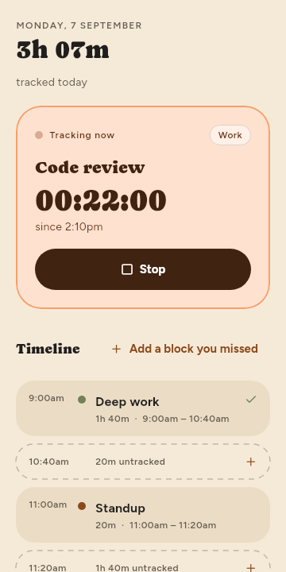
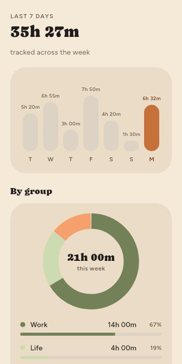
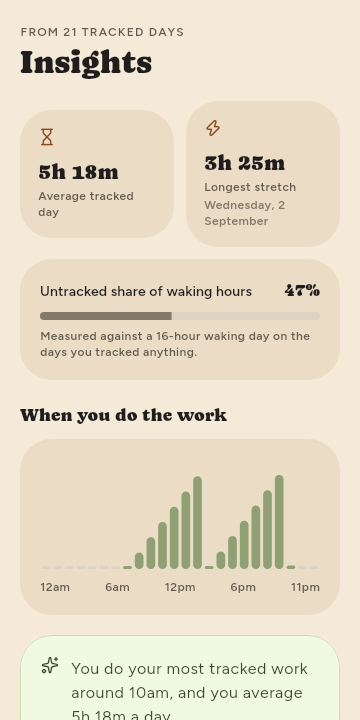
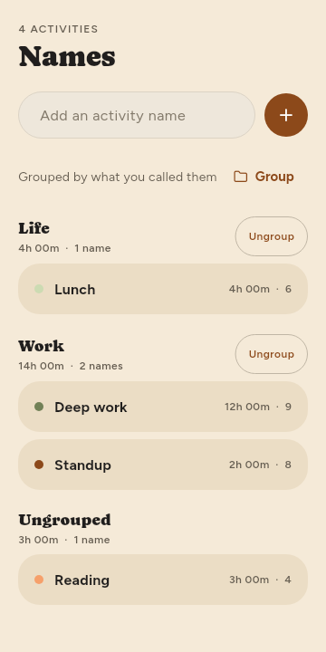

# Tally

Track where the day went: a live timer, blocks you fill in after the fact,
grouped activity names, stats and insights, and a push to Google Calendar.

Android only, offline by default — nothing leaves the device until you connect
a calendar yourself.

<p align="center">
  
  
  
  
</p>

## Install on a phone

Build the APKs, then copy the one that matches your phone across:

```bash
flutter build apk --release --split-per-abi
```

| `build/app/outputs/flutter-apk/…` | Use it when |
| --- | --- |
| `app-arm64-v8a-release.apk` | Any phone from roughly 2016 on. **Start here.** |
| `app-armeabi-v7a-release.apk` | Older 32-bit device. |
| `app-release.apk` | Not sure — universal, works everywhere, just larger. |

Android will ask you to allow installing from your browser or file manager the
first time. The app then asks for notification permission, which is what keeps
the running timer alive and visible.

## What it does

- **Today** — a live timer that survives the app being killed, a timeline of the
  day, and dashed rows over every untracked gap of 10 minutes or more that you
  can tap to fill in.
- **Stats** — seven daily bars and a donut of where the week went by group.
- **Insights** — average tracked day, longest unbroken stretch, untracked share
  of waking hours, and which hours you actually work in.
- **Names** — every activity you have named, sectioned by group, with a select
  mode for regrouping several at once.
- **Sync** — four steps to put finished blocks on one Google Calendar you pick.

## Calendar sync needs your own Google client id

Google ties OAuth to the signing certificate of the app, so a published build
cannot ship working credentials for someone else's Google account. Sync in the
release APK will tell you it is not configured; everything else works.

To enable it for yourself:

1. In the [Google Cloud console](https://console.cloud.google.com), create a
   project and enable the **Google Calendar API**.
2. Create an **OAuth client id** of type *Android*, with package name
   `com.tally.tally` and the SHA-1 of the key you sign with
   (`keytool -list -v -keystore <your.jks> -alias tally`).
3. Create a second client id of type **Web application** — its id is what the
   Android sign-in flow needs.
4. Build with it:

   ```bash
   flutter build apk --release \
     --dart-define=GOOGLE_SERVER_CLIENT_ID=<your web client id>
   ```

Tally only ever writes to the one calendar you choose, and pulled events are
offered as suggestions you confirm — it never creates blocks silently.

## Building from source

Requires Flutter stable (3.47+) and the Android SDK.

```bash
flutter pub get
dart run build_runner build      # drift database code
flutter test                     # 64 tests, including one golden per screen
flutter build apk --release --split-per-abi
```

Release signing reads `android/key.properties` (not in the repo). Without it the
build falls back to the debug key, which is fine for local testing but produces
APKs that cannot upgrade an existing install.

Goldens were generated on Linux; regenerate with
`flutter test --update-goldens` if you are on another platform.

## How it is put together

```
lib/
  core/      theme (the Organic palette as a ThemeExtension) and time formatting
  domain/    plain models and the pure functions the tests pin down
  data/      drift schema, repositories, and the prefs store
  features/  today, stats, insights, names, sync — one folder per tab
  services/  the foreground timer and the WorkManager sync task
```

The rules worth knowing before changing anything:

- **Elapsed time is never accumulated in memory.** Only `startedAt` is stored;
  every readout is `now - startedAt`. Killing the app mid-run and reopening it
  resumes with the correct elapsed time.
- **At most one block has `endedAt == null`**, enforced in the repository rather
  than the UI — starting a second timer closes the first.
- **Groups are a string on `activities`, not a table.** Regrouping is a bulk
  update; `null` means the Ungrouped bucket.
- Screens never load a full table in a build method; totals are aggregated in
  SQL and every query is bounded by a date range.
